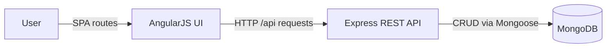

# Smart Campus Support System (AngularJS + Express + MongoDB)

Smart Campus Support System is a **fully dynamic web application** that helps a campus manage:
- **Complaints / Issues** (submit → prioritize → resolve)
- **Lost & Found** items (post → browse → claim → close as resolved)

It is implemented as an **AngularJS single-page application** backed by a **RESTful Node.js/Express API** with **MongoDB** persistence (Mongoose).

## Features (high-level)

- **Authentication**: JWT-based signup/login
- **Role-based access control (RBAC)**:
  - `student`, `staff`, `admin`
  - **Ownership enforcement**: only the creator can edit/close their lost/found posts and complaints
- **Complaints**:
  - Other users can **support/upvote** a complaint (one support per user)
  - Filter complaints by **minimum supports**
  - Admin can assign **importance** levels for prioritization
- **Lost & Found**:
  - Items are **closed** (resolved) instead of deleted (records remain stored)
  - **Self-claim prevention**: users cannot claim their own lost/found posts
- **Profile activity**: shows counts of lost/found posts, complaints raised, supports given, claims submitted
- **Error handling**: consistent JSON errors with meaningful status codes

## System architecture

- **AngularJS Frontend** sends async REST requests (via `$http`) to the **Node/Express Backend**
- **Express Controllers** validate input + enforce RBAC/ownership rules
- **Mongoose Models** perform CRUD operations on **MongoDB**



## Project structure

- `backend/` — Express REST API, Mongoose models, controllers, routes, middleware
- `frontend/` — AngularJS SPA (`index.html`, `app.js`, `styles.css`) served as static files by the backend
- `REPORT.md` — detailed report template (architecture + flow)

## Prerequisites

- Node.js + npm
- MongoDB running locally (or set a remote connection string)

## Setup & run

1. Install backend dependencies:

```bash
cd backend
npm install
```

2. Configure environment variables:
   - Copy/update `backend/.env` (see `backend/.env.example`)
   - Required: `MONGODB_URI`, `JWT_SECRET`

3. Start the server:

```bash
npm start
```

4. Open the UI:
   - `http://localhost:5000/`

## Default admin (seed)

If `SEED_STAFF=true` in `backend/.env`, the server seeds a default admin user:
- `DEFAULT_STAFF_EMAIL`
- `DEFAULT_STAFF_PASSWORD`

## Users, roles, and authentication

### Roles
- **student**: default role for new signups
- **staff**: workflow reviewer for claims
- **admin**: can set complaint importance (and also has staff capabilities)

### Authentication
- Login returns a **JWT**; for protected endpoints send:
  - `Authorization: Bearer <token>`
- Token payload includes:
  - `sub` (user id), `role`

## Database integration (MongoDB) and dataset schema

MongoDB collections are backed by Mongoose models in `backend/src/models/`.

### `users`
- `name` (required)
- `email` (required, unique)
- `passwordHash` (required)
- `role` (`student|staff|admin`, default `student`)
- Optional profile fields:
  - `phone`, `department`, `year`, `hostel`, `bio`
- `createdAt`, `updatedAt`

### `lostitems`
- `itemName`, `description`, `locationFoundOrLastSeen`, `date`
- `status` (`active|closed`)
- `createdBy` (ref `users`)
- timestamps

### `founditems`
- `itemName`, `description`, `locationFound`, `date`
- `status` (`active|closed`)
- `createdBy` (ref `users`)
- timestamps

### `claims`
- `type` (`lost|found`)
- `lostItemId` (ref `lostitems`) **or** `foundItemId` (ref `founditems`)
- `claimedBy` (ref `users`)
- `message`
- `claimStatus` (`pending|approved|rejected|resolved`)
- `reviewedBy` (ref `users`) — set when staff/admin reviews status
- timestamps

### `complaints`
- `title`, `description`, `category`, `location`
- `status` (`submitted|in_progress|resolved`)
- `supportsCount` (number)
- `importanceLevel` (0–3; admin-assigned)
- `createdBy` (ref `users`)
- `assignedTo` (ref `users`, optional; reserved for future workflow use)
- timestamps

### `complaintsupports`
- `complaintId` (ref `complaints`)
- `userId` (ref `users`)
- Unique index: **(complaintId, userId)** (one support per user)

## REST API backend

### Base URL
- API base: `http://localhost:5000/api`

### Error handling (API)
Errors return consistent JSON and HTTP status codes:
- `400` validation/action not allowed
- `401` missing/invalid JWT
- `403` forbidden (ownership/role restrictions)
- `404` resource not found
- `500` unexpected server errors

## API endpoints (complete list)

All endpoints below require `Authorization: Bearer <token>` **except** signup/login.

### Auth
- `POST /api/auth/signup` — create account (student by default)
- `POST /api/auth/login` — authenticate, returns JWT
- `GET /api/auth/me` — current user + activity counts

### Complaints (CRUD + supports + admin importance)
- `GET /api/complaints`
  - Query params:
    - `status=submitted|in_progress|resolved` (optional)
    - `sortBy=date|supports|importance` (optional)
    - `minSupports=<number>=0` (optional)
- `POST /api/complaints` — create complaint
- `GET /api/complaints/:id` — get one complaint
- `PUT /api/complaints/:id` — **creator-only** update/close
- `DELETE /api/complaints/:id` — **creator-only** delete
- `POST /api/complaints/:id/support` — support a complaint (**not allowed** on own complaint)
- `DELETE /api/complaints/:id/support` — remove support
- `PUT /api/complaints/:id/importance` — set importance (**admin-only**, `importanceLevel: 0..3`)

### Lost items (CRUD; UI uses close instead of delete)
- `GET /api/lost-items?status=active|closed` — list items
- `POST /api/lost-items` — create lost report
- `GET /api/lost-items/:id` — get one item
- `PUT /api/lost-items/:id` — **creator-only** edit/close/reopen (`status=active|closed`)
- `DELETE /api/lost-items/:id` — available but not used by UI (prefer close)

### Found items (CRUD; UI uses close instead of delete)
- `GET /api/found-items?status=active|closed` — list items
- `POST /api/found-items` — create found post
- `GET /api/found-items/:id` — get one item
- `PUT /api/found-items/:id` — **creator-only** edit/close/reopen (`status=active|closed`)
- `DELETE /api/found-items/:id` — available but not used by UI (prefer close)

### Claims (workflow CRUD)
- `GET /api/claims` — list claims (students see their own)
- `POST /api/claims` — create claim for an active item
  - Server validates:
    - item must be `active`
    - no duplicates per user+item
    - **no self-claims**
- `GET /api/claims/:id` — get one claim
- `PUT /api/claims/:id`
  - creator can edit **message only** while `pending`
  - staff/admin can update **claimStatus**
- `DELETE /api/claims/:id` — creator-only, only while `pending`

## CRUD operations summary (modules)

- **Complaints**: Create / Read / Update / Delete + Support + Admin importance
- **Lost items**: Create / Read / Update (close/reopen) (+ delete endpoint exists, but UI keeps records)
- **Found items**: Create / Read / Update (close/reopen) (+ delete endpoint exists, but UI keeps records)
- **Claims**: Create / Read / Update / Delete (policy-limited)

## Main UI routes (AngularJS)

`/login`, `/signup`, `/dashboard`, `/complaints`, `/lost-items`, `/found-items`, `/claims`, `/profile`

## Example user flow

1. Sign up → login
2. Create a complaint; other users can support it
3. Report a lost item / post a found item
4. Other users browse active items and submit claims (cannot claim their own posts)
5. Close items as resolved (records stay stored)


