# 🎓 Smart Campus Support System

A **full-stack web application** designed to streamline campus issue management and lost & found services.
Built using **AngularJS (Single-page application), Node.js (Express), and MongoDB**, the system provides a centralized platform for students, staff, and administrators.

It is implemented as an **AngularJS single-page application** backed by a **RESTful Node.js/Express API** with **MongoDB** persistence (Mongoose).

---

## 🚀 Key Features

### 🔐 Authentication & Authorization

* JWT-based secure login/signup
* Role-Based Access Control (RBAC): Student, Staff, Admin

### 📢 Complaint Management

* Submit complaints/issues
* Upvote (support) complaints (1 support per user)
* Filter complaints
* Admin can assign importance
* Track complaint status

### 🎒 Lost & Found System

* Post lost/found items
* Browse items
* Claim items (no self-claims)
* Close items instead of deleting

### 👤 User Dashboard

* Complaints raised
* Supports given
* Lost/Found posts
* Claims made

---

## 🌐 Local Demo

🔗 **Local Application:** [Smart Campus Support System](http://localhost:5000/)

---

## 📸 Screenshots

### 🔐 Sign Up

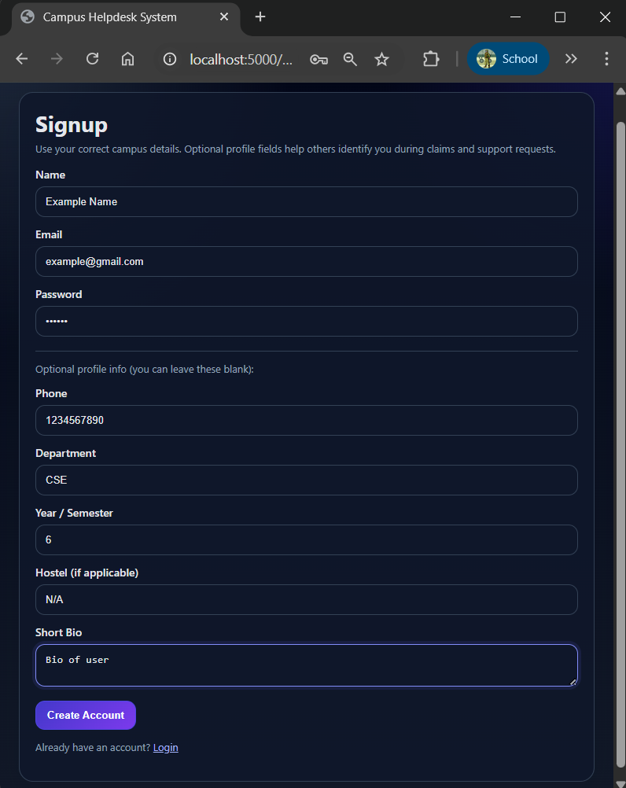

### 🔐 Login Page

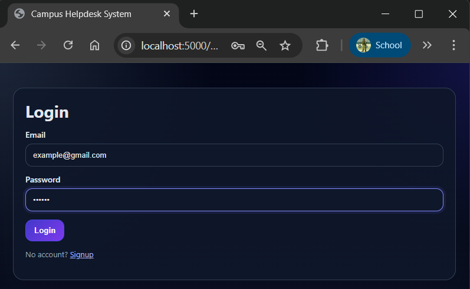

### 📊 Dashboard

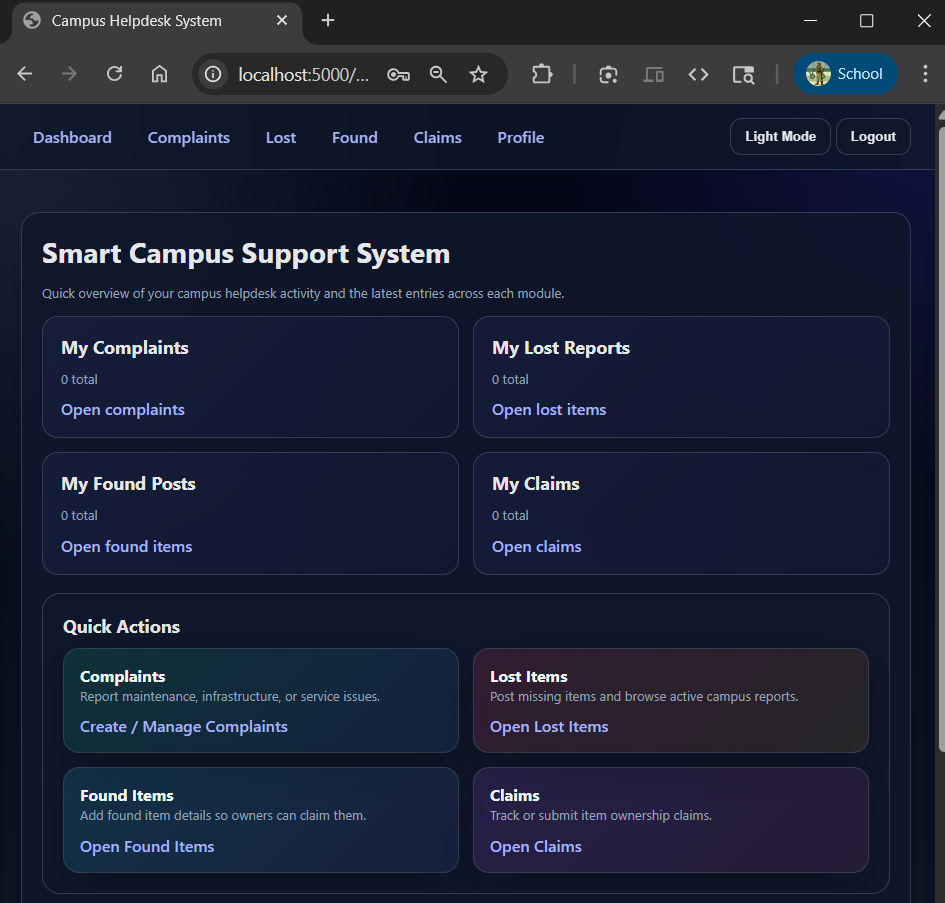
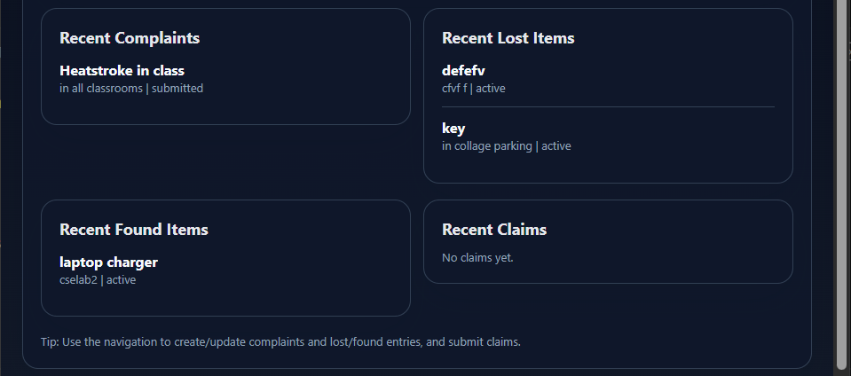

### 📢 Complaints Page

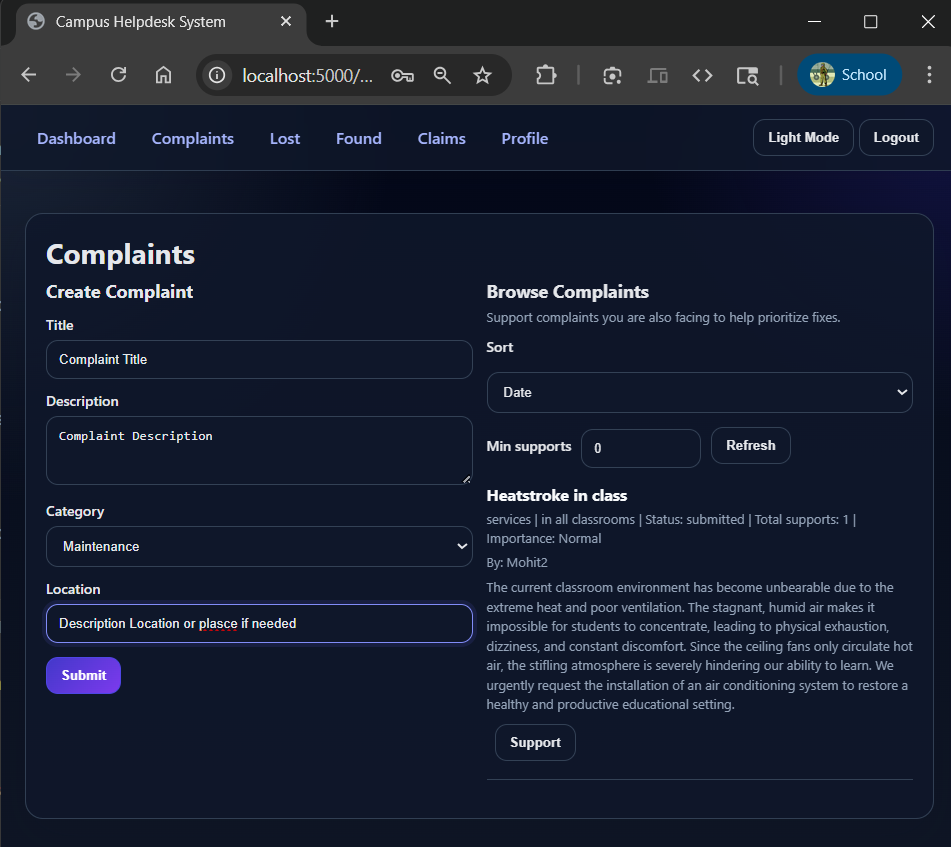
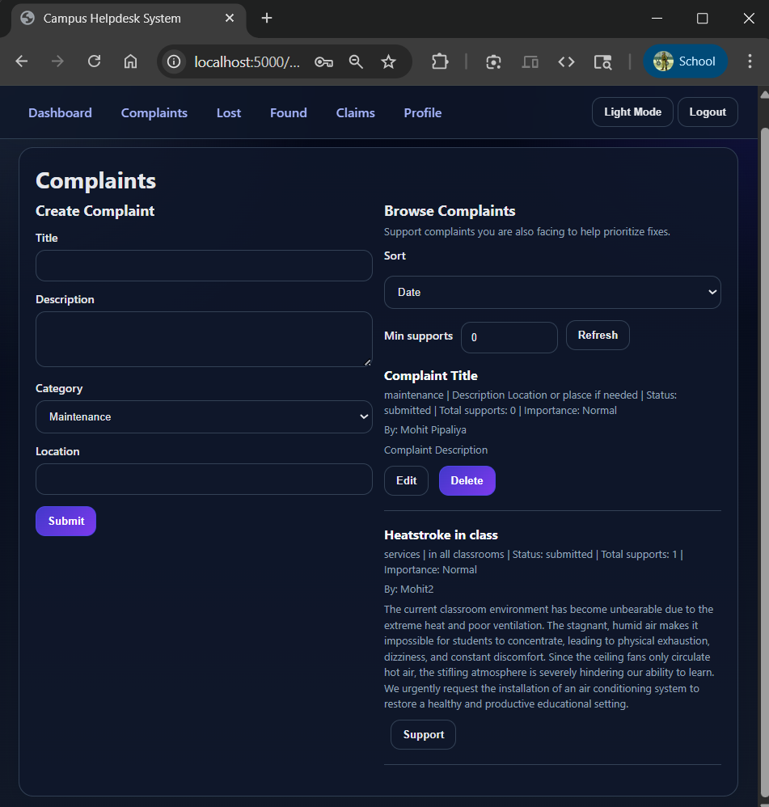

### 🎒 Lost

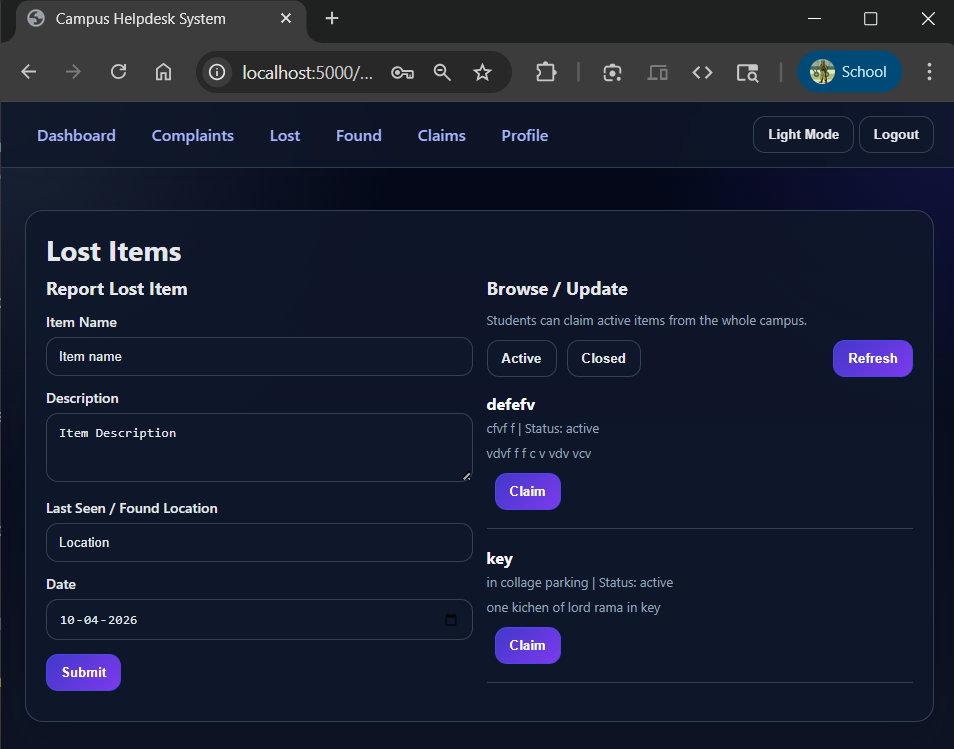
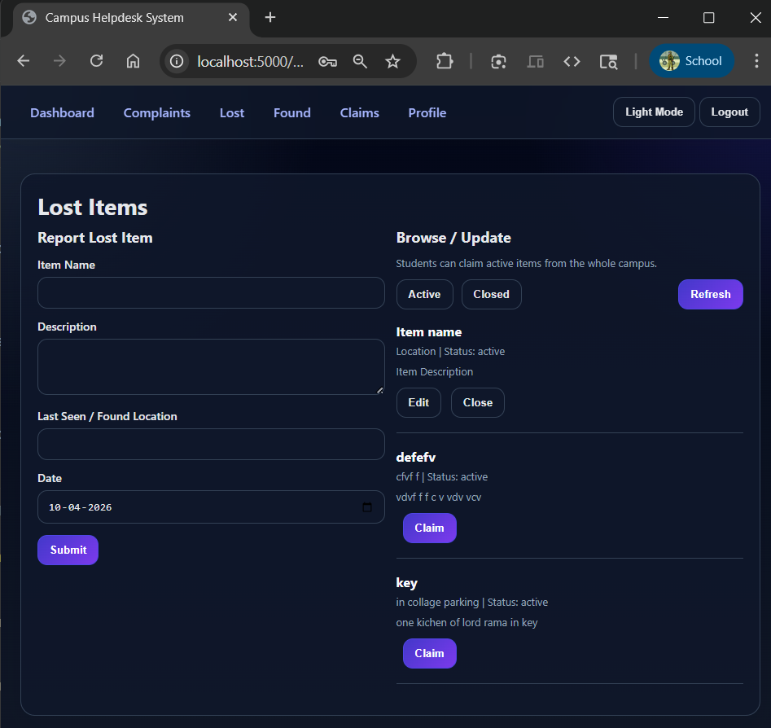

### 🎒 Found

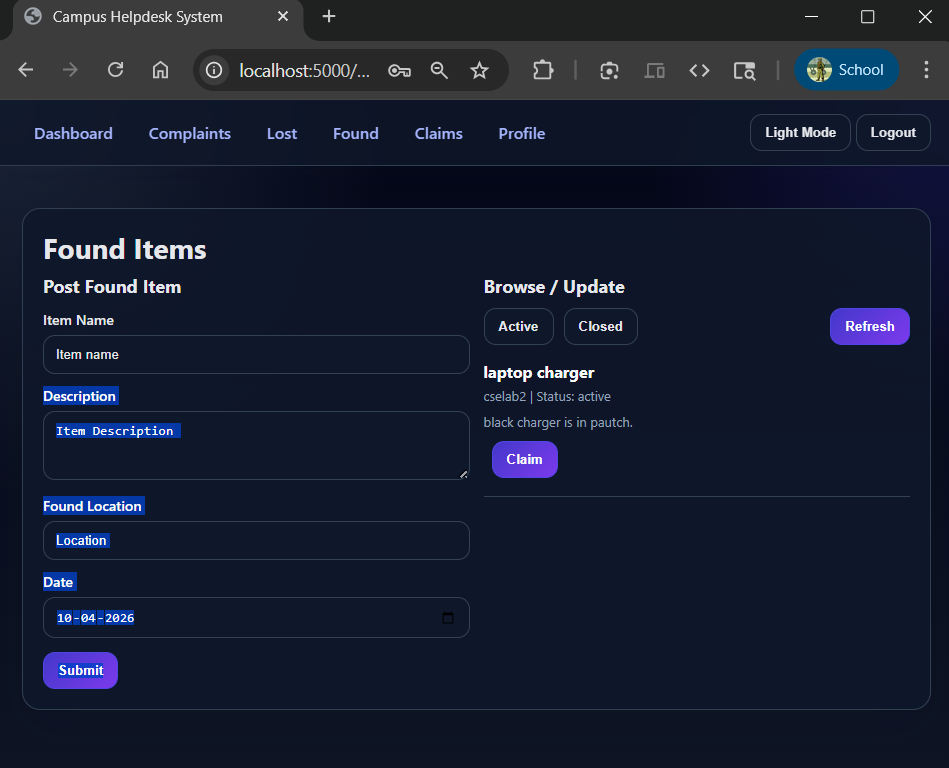
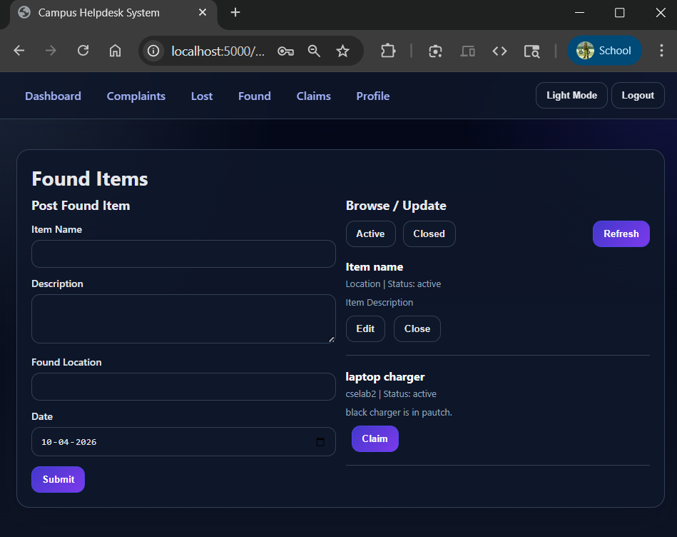

### 🔄 Claims Management

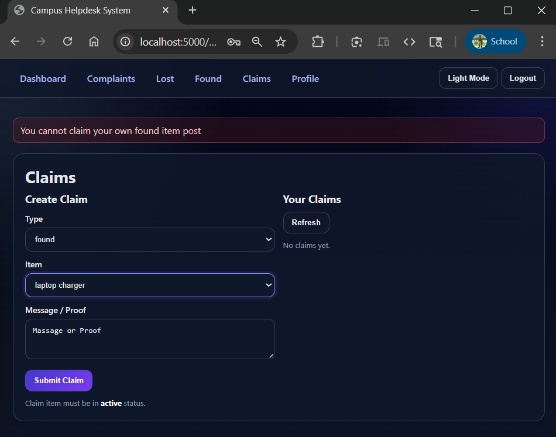
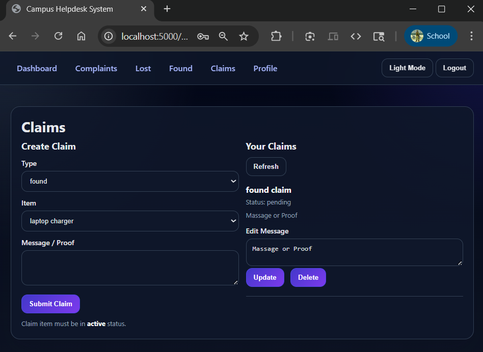

---

## 🧪 Default Admin (Seeding)

If enabled in `.env`:

```
SEED_STAFF=true
DEFAULT_STAFF_EMAIL=admin@example.com
DEFAULT_STAFF_PASSWORD=admin123
```

Creates a default admin user on server start.

### 🔄 Admin Profile

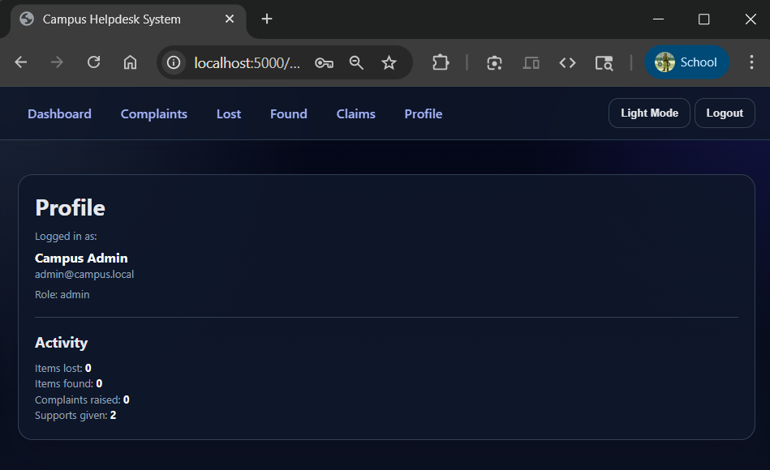

### 🔄 Give Importance

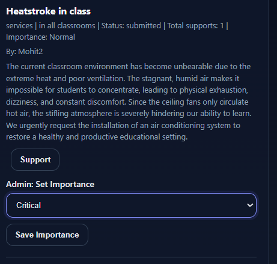

### 🔄 Update Claim Status

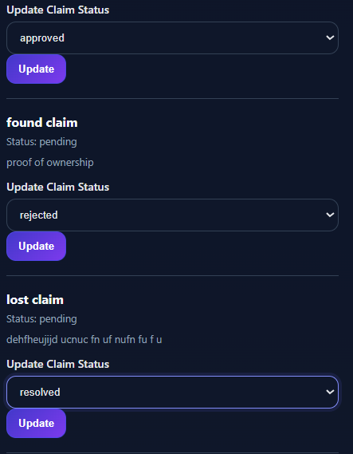

---

## 👥 Roles & Authentication

### Roles

* student (default)
* staff
* admin

### Authentication

```
Authorization: Bearer <token>
```

Token contains: `sub`, `role`

---

## 🗄️ Database Schema

### users

name, email, passwordHash, role, profile fields, timestamps

### lostitems / founditems

itemName, description, location, date, status, createdBy

### claims

item refs, claimedBy, message, claimStatus, reviewedBy

### complaints

fields + supportsCount + importanceLevel

### complaintsupports

unique (complaintId, userId)

---

## 🌐 API Base URL

```
http://localhost:5000/api
```

### Error Codes

* 400: Validation error
* 401: Unauthorized
* 403: Forbidden
* 404: Not found
* 500: Server error

---

## 📡 API Endpoints

### Auth

* POST /api/auth/signup
* POST /api/auth/login
* GET /api/auth/me

### Complaints

* CRUD operations
* Support / unsupport
* Admin importance
* Priority + timeline status flow (created → assigned → in_progress → resolved)
* Summary + analytics endpoints for dashboards

### Lost / Found Items

* CRUD operations
* Close/reopen preferred over delete

### Claims

* Create claim
* Staff/Admin review
* Restricted updates

---

## 🧪 API Request / Response Examples

### ✅ Standard Success Response Format

Most endpoints return:

```json
{
  "success": true,
  "message": "Human readable message",
  "data": {}
}
```

### 🧪 Postman Collection

Import `postman/Smart-Campus-Support.postman_collection.json` for quick API testing (includes auth, complaints, summary, analytics, assign/status).

### 🔐 Login

**Request:**

```json
POST /api/auth/login
{
  "email": "user@example.com",
  "password": "password123"
}
```

**Response:**

```json
{
  "token": "eyJhbGciOiJIUzI1NiIsInR5cCI6IkpXVCJ9...",
  "user": {
    "id": "64f123abc",
    "role": "student"
  }
}
```

---

### 📢 Create Complaint

**Request:**

```json
POST /api/complaints
Authorization: Bearer <token>

{
  "title": "WiFi not working",
  "description": "Internet is down in hostel",
  "category": "Infrastructure",
  "location": "Hostel A"
}
```

**Response:**

```json
{
  "message": "Complaint created successfully",
  "complaintId": "65123abc"
}
```

---

### 🎒 Create Lost Item

**Request:**

```json
POST /api/lost-items
Authorization: Bearer <token>

{
  "itemName": "Wallet",
  "description": "Black leather wallet",
  "locationFoundOrLastSeen": "Library",
  "date": "2026-04-15"
}
```

**Response:**

```json
{
  "message": "Lost item reported",
  "itemId": "65abc123"
}
```

---

### 🔄 Create Claim

**Request:**

```json
POST /api/claims
Authorization: Bearer <token>

{
  "type": "lost",
  "lostItemId": "65abc123",
  "message": "This item belongs to me"
}
```

**Response:**

```json
{
  "message": "Claim submitted",
  "claimId": "66def456"
}
```

---

## 🧭 Frontend Routes

/login
/signup
/dashboard
/complaints
/lost-items
/found-items
/claims
/profile

---

## 🔄 User Flow

1. Signup/Login
2. Create complaint
3. Post lost/found items
4. Other users claim items
5. Staff/Admin review claims
6. Resolve items (closed, not deleted)

---

## 🧠 Design Highlights

* Clean frontend-backend separation
* RESTful architecture
* Scalable RBAC system
* Strong validation & ownership rules

---

## 📌 Future Improvements

* Real-time notifications (WebSockets)
* Integrate chat system between student and admin/staff for better communication
* Image upload support
* Email/SMS alerts
* Enable feedback and rating system after complaint resolution
* Enhance dashboard with advanced analytics (resolution time, staff performance)
* Admin analytics dashboard
* Improve security with two-factor authentication (2FA)
* Mobile app version

---

## 📄 License

Educational use

---

## 👨‍💻 Author

**Mohit Pipaliya**

---

## ⭐ Contribution

Feel free to fork and contribute!
