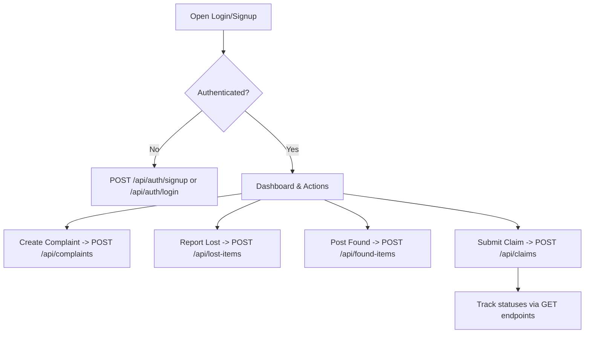

# Campus Helpdesk System - Project Report

## 1. Problem Statement
Campuses require a practical way to manage:
1. **Complaints/Issues** (infrastructure, maintenance, services, etc.) from submission to resolution.
2. **Lost & Found** items, so rightful owners can recover belongings.

This system provides a centralized, authenticated platform for students and staff to report, track, and resolve campus issues and lost/found items.

## 2. System Architecture
### High-level Interaction
- **AngularJS Frontend** sends REST requests (async via `$http`) to the **Node/Express Backend**.
- **Express Controllers** validate requests and apply authorization rules.
- **Mongoose Models** perform CRUD operations on **MongoDB** collections.

```mermaid
flowchart LR
  U[Student / Staff UI] -->|HTTP (REST)| FE[AngularJS SPA]
  FE -->|HTTP /api requests| BE[Node.js + Express REST API]
  BE -->|CRUD| DB[MongoDB]
```

## 3. URI Design / User Flow
### Main URLs (UI Routes)
`/login`, `/signup`, `/dashboard`, `/complaints`, `/lost-items`, `/found-items`, `/claims`, `/profile`

### Main REST API Routes (Backend)
`/api/auth/*`
`/api/complaints/*`
`/api/lost-items/*`
`/api/found-items/*`
`/api/claims/*`



## 4. Database Design (MongoDB Collections)
### Collections
1. `users`
2. `complaints`
3. `lostitems`
4. `founditems`
5. `claims`

### Relationships
- `users (1) -> complaints (many)` via `createdBy`
- `users (1) -> lostitems (many)` via `createdBy`
- `users (1) -> founditems (many)` via `createdBy`
- `users (1) -> claims (many)` via `claimedBy`
- `claims` references **either** one lost item (**lostItemId**) or one found item (**foundItemId**)

### Suggested Fields (as implemented)
- **users**
  - `name`, `email`, `passwordHash`, `role`
- **complaints**
  - `title`, `description`, `category`, `location`, `status`, `createdBy`, `assignedTo`
- **lostitems**
  - `itemName`, `description`, `locationFoundOrLastSeen`, `date`, `status`, `createdBy`
- **founditems**
  - `itemName`, `description`, `locationFound`, `date`, `status`, `createdBy`
- **claims**
  - `type` (`lost` or `found`), `lostItemId`, `foundItemId`, `claimedBy`, `message`, `claimStatus`, `reviewedBy`

## 5. REST API Endpoints
### Auth
- `POST /api/auth/signup` : Create a new user account
- `POST /api/auth/login` : Authenticate and return JWT
- `GET /api/auth/me` : Return current logged-in user

### Complaints (CRUD)
- `GET /api/complaints` : List complaints
- `POST /api/complaints` : Create complaint
- `GET /api/complaints/:id` : Get one complaint
- `PUT /api/complaints/:id` : Update complaint (staff/admin can update `status`)
- `DELETE /api/complaints/:id` : Delete complaint

### Lost Items (CRUD)
- `GET /api/lost-items` : List lost items (students can browse active campus items)
- `POST /api/lost-items` : Create lost report
- `GET /api/lost-items/:id` : Get one lost item
- `PUT /api/lost-items/:id` : Update lost item (staff/admin can update `status`)
- `DELETE /api/lost-items/:id` : Delete lost item

### Found Items (CRUD)
- `GET /api/found-items` : List found items (students can browse active campus items)
- `POST /api/found-items` : Create found post
- `GET /api/found-items/:id` : Get one found item
- `PUT /api/found-items/:id` : Update found item (staff/admin can update `status`)
- `DELETE /api/found-items/:id` : Delete found item

### Claims (Workflow CRUD)
- `GET /api/claims` : List claims
- `POST /api/claims` : Submit a claim for a lost/found item
- `GET /api/claims/:id` : Get one claim
- `PUT /api/claims/:id` : Update claim (staff/admin can change `claimStatus`)
- `DELETE /api/claims/:id` : Delete claim (policy-limited)

### Error Handling (Implemented)
The API returns consistent JSON on errors:
- `400` for validation errors
- `401` for missing/invalid JWT
- `403` for role/permission violations
- `404` for missing resources
- `500` for unexpected server issues

## 6. Screenshots 
Add screenshots of:
1. Signup page
2. Login page
3. Dashboard
4. Create/View/Update Complaints
5. Create Lost Item + Browse Active Lost Items
6. Post Found Item + Browse Active Found Items
7. Submit Claim + Update by staff


---

## 6. 🌐 Local Demo & 📸 Screenshots

🔗 **Local Application:** [Smart Campus Support System](http://localhost:5000/)

---

### 📸 Screenshots

#### 🔐 Sign Up


#### 🔐 Login Page


#### 📊 Dashboard


#### 📢 Complaints Page


#### 🎒 Lost


#### 🎒 Found


#### 🔄 Claims Management


---

### 🧪 Default Admin (Seeding)

If enabled in `.env`:

```
SEED_STAFF=true
DEFAULT_STAFF_EMAIL=admin@example.com
DEFAULT_STAFF_PASSWORD=admin123
```

Creates a default admin user on server start.

#### 🔄 Admin Profile


#### 🔄 Give Importance


#### 🔄 Update Claim Status


---

## 7. Conclusion
The Campus Helpdesk System integrates complaint tracking and lost/found management into a single authenticated platform. By combining AngularJS (client) with Node.js/Express (server) and MongoDB (database), the project demonstrates RESTful HTTP communication, asynchronous client-server interaction, MVC design principles, and CRUD-based resource management.